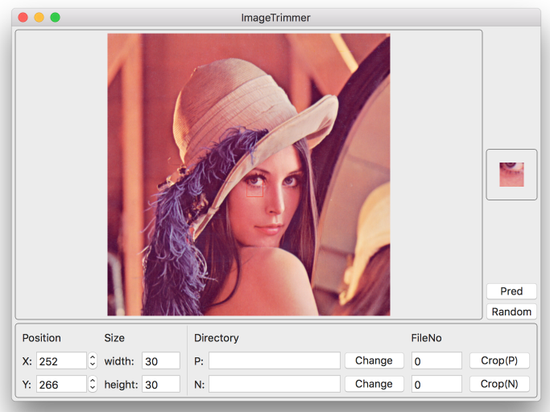
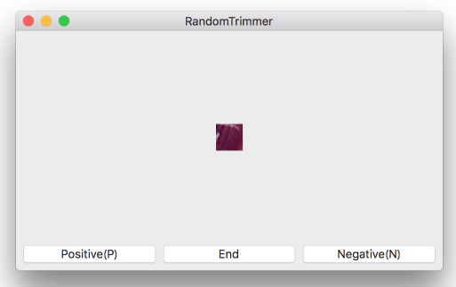
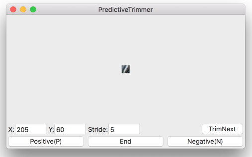

# ImageTrimmer
Image trimming tool for Machine Learning.

For trimming numerous, fixed size images from one image.

Xcode8/Swift3/OSX

Currently, it's specialized for binary classification.

## Usage

### Common


1. Drag and drop image in the upper box.
1. Set output directories and file numbers(they will increment automatically).
1. Set width and height.

### Trim manually
1. [Common](#common)
1. Set x and y(Input value, or just click image).
1. Trimming preview will be shown on the right box.
1. Press "Trim(P)" or "Trim(N)" button to trim and save positive/negative image.

Can zoom, scroll.

### Trim randomly


1. [Common](#common)
1. Press "Random" button, then new window will open.
1. Randomly trimmed image will be shown, Press "Positive"/"Negative" button to save image.

### Search and Trim Positive-like point


Need Positive and Negative samples.

1. [Common](#common)
1. Press "Pred" button.
1. Select directory which contains "Positive" samples(size of images and ("width", "height") you set must be same).
1. Select "Negative" directory likewise.
1. New window will open. Set "stride" and click "TrimNext" button.
1. Positive-like image will be shown, Press "Positive"/"Negative" button to save image.

- Search proceeds by "stride" pixels in Row-major order.

## Run

Requires [Carthage](https://github.com/Carthage/Carthage).

```
git clone https://github.com/t-ae/ImageTrimmer.git
cd ImageTrimmer
carthage bootstrap --platform macOS
open ImageTrimmer.xcodeproj
```

## License
[MIT License](./LICENSE)
